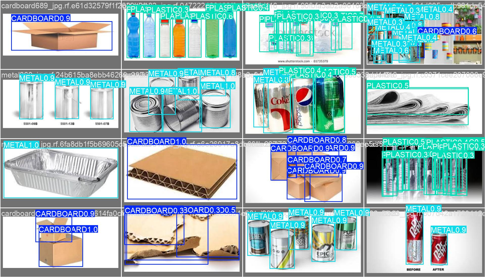
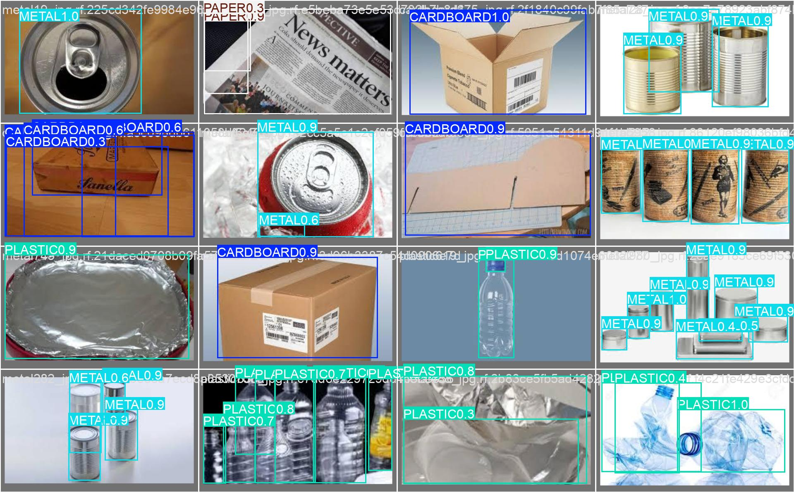
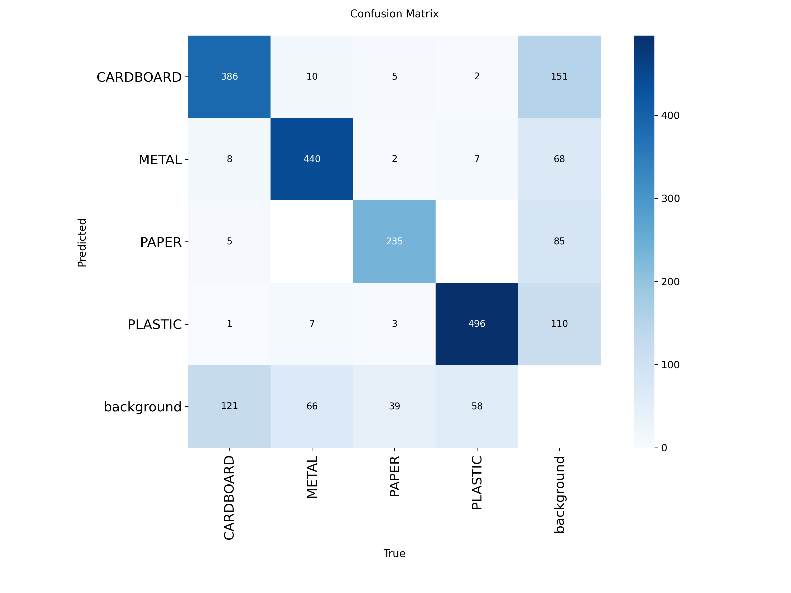
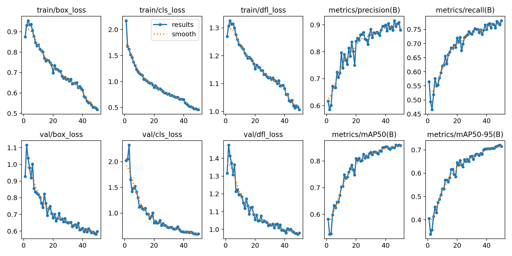
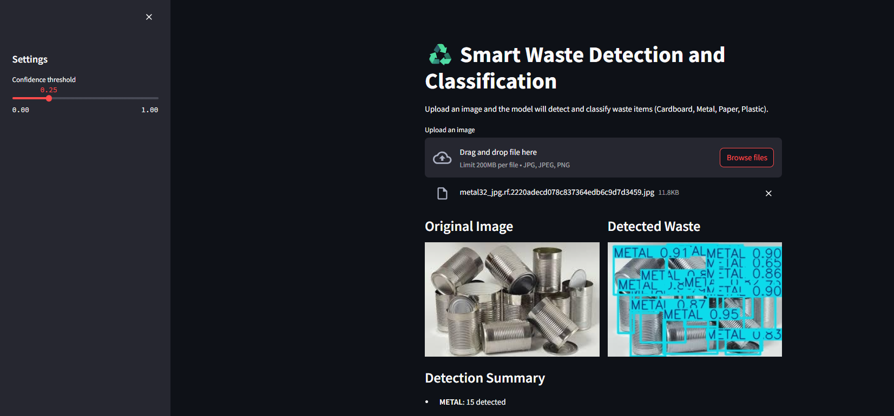

# ♻️ YOLOWaste — Smart Waste Detection and Classification using YOLOv8

<div align="center">


<br/>

**A YOLOv8-based object detection system that identifies and classifies waste materials — Cardboard, Metal, Paper, and Plastic — from images, packaged with a class-balanced training pipeline and an interactive Streamlit demo.**

</div>

---

## 🚀 Live Demo

<div align="center">

[](https://yolowaste-mn5rvjutgqzauabdg6xx8x.streamlit.app/)

> ⚠️ **App may be sleeping** — Streamlit free tier may hibernate after inactivity. Click **Live App** and wait ~30s for it to spin up.

</div>

---

## 📚 Table of Contents

<ul>
  <li><a href="#-project-overview">📌 Project Overview</a></li>
  <li><a href="#-live-demo">🚀 Live Demo</a></li>
  <li><a href="#-problem-statement">❗ Problem Statement</a></li>
  <li><a href="#-project-structure">📂 Project Structure</a></li>
  <li><a href="#️-tech-stack">🛠️ Tech Stack</a></li>
  <li><a href="#-dataset">📊 Dataset</a></li>
  <li><a href="#-methodology">⚙️ Methodology</a></li>
  <li><a href="#-model-training--performance">🤖 Model Training & Performance</a></li>
  <li><a href="#-per-class-results">📈 Per-Class Results</a></li>
  <li><a href="#-screenshots--visuals">📷 Screenshots & Visuals</a></li>
  <li><a href="#-application-features">🚀 Application Features</a></li>
  <li><a href="#️-run-locally">▶️ Run Locally</a></li>
  <li><a href="#-future-improvements">🔭 Future Improvements</a></li>
  <li><a href="#-author">👩‍💻 Author</a></li>
</ul>

---

## 📌 Project Overview

Improper waste sorting is one of the biggest bottlenecks in effective recycling — most sorting is still done manually, is slow, and is prone to error. YOLOWaste addresses this by training a **YOLOv8 object detection model** to automatically identify and classify waste materials directly from images, laying the groundwork for AI-assisted waste sorting systems.

This project answers the question:

> **"Given an image containing waste, what materials are present, where are they located, and what type are they?"**

Built as a third-year B.Tech CSE (Data Science) deep learning project.

---

## ❗ Problem Statement

Manual waste segregation faces several challenges:

- Labor-intensive and inconsistent categorization
- Contamination of recyclables due to human sorting errors
- No real-time, scalable way to classify waste at collection points
- Limited automated tools for municipal and industrial waste triage

YOLOWaste demonstrates how a lightweight, trainable object detection pipeline can automatically detect and classify waste materials — a foundational step toward automated sorting systems.

---

## 📂 Project Structure

```text
YOLOWaste/
│
├── data/                    # dataset (images + labels), gitignored
│   ├── images/{train,val,test}
│   ├── labels/{train,val,test}
│   └── raw/
├── data.yaml                # YOLO class/path configuration
│
├── notebooks/
│   └── training.ipynb       # training experiments (Colab)
│
├── models/
│   └── best.pt               # trained YOLOv8 weights
│
├── scripts/
│   ├── train.py              # training script
│   ├── detect.py             # inference on images/folders
│   └── split_dataset.py      # class-balanced stratified train/val/test splitter
│
├── results/
│   ├── plots/                 # confusion matrix, PR curve, training curves
│   └── sample_predictions/    # annotated detection outputs
│
├── app/
│   └── app.py                 # Streamlit demo app
│
├── requirements.txt
├── LICENSE
└── README.md
```

---

## 🛠️ Tech Stack

<div align="center">

| 🏷️ Category | 🔧 Tools |
|---|---|
| 🐍 **Language** | Python 3.11 |
| 🎯 **Object Detection** | YOLOv8 (Ultralytics) |
| 🔥 **Deep Learning Framework** | PyTorch |
| 📊 **Dataset Source** | Roboflow Universe |
| 🚀 **Deployment / Demo** | Streamlit |
| 📈 **Visualization** | Matplotlib, Ultralytics built-in plotting |
| ☁️ **Training Compute** | Google Colab (Tesla T4 GPU) |
| ✂️ **Data Splitting** | scikit-learn (stratified split) |

</div>

---

## 📊 Dataset

**[GARBAGE CLASSIFICATION 4](https://universe.roboflow.com/recycling-vs-waste/garbage-classification-4-oklrj)** — Roboflow Universe

- **Total images:** 4,178
- **Classes (4):** Cardboard, Metal, Paper, Plastic
- **Format:** YOLOv8 (bounding box annotations)

> The dataset itself is not included in this repository due to size — download it from the link above to reproduce training. See [Run Locally](#️-run-locally) for setup.

---

## ⚙️ Methodology

1. **Dataset acquisition** — sourced pre-annotated waste detection data from Roboflow Universe, exported in YOLOv8 format.
2. **Class-balanced re-splitting** — the original Roboflow train/val/test split had severe class imbalance across splits (e.g. one class nearly absent from validation). Built a custom stratified splitter (`scripts/split_dataset.py`) that assigns each image a dominant class and re-splits 70/20/10 so every class is proportionally represented in every split.
3. **Training** — fine-tuned a pretrained YOLOv8n (nano) model for 50 epochs on Google Colab's free GPU tier.
4. **Evaluation** — validated per-class performance (precision, recall, mAP50, mAP50-95) to confirm balanced, trustworthy metrics across all four classes.
5. **Deployment** — packaged the trained model into a Streamlit app for interactive image upload and detection.

---

## 🤖 Model Training & Performance

<div align="center">

| ⚙️ Config | 📊 Value |
|---|---|
| Model | YOLOv8n (nano) |
| Epochs | 50 |
| Image size | 640×640 |
| Batch size | 16 |
| Optimizer | AdamW (auto-selected) |
| Train / Val / Test split | 2,924 / 836 / 418 images (class-balanced) |
| Training hardware | Tesla T4 GPU (Google Colab) |
| Training time | ~41 minutes |

</div>

**Overall validation metrics:**

<div align="center">

| Metric | Score |
|---|---|
| Precision | 90.5% |
| Recall | 77.1% |
| **mAP50** | **86.0%** |
| mAP50-95 | 72.1% |

</div>

---

## 📈 Per-Class Results

<div align="center">

| Class | Instances (val) | mAP50 |
|---|---|---|
| 📦 Cardboard | 521 | 79.2% |
| 🔩 Metal | 523 | 88.0% |
| 📄 Paper | 284 | 85.9% |
| 🧴 Plastic | 563 | 90.8% |

</div>

Unlike the original (imbalanced) dataset split — where two classes had fewer than 5 validation instances and produced statistically meaningless metrics — every class here has 250+ validation instances, making these numbers genuinely trustworthy.

See `results/plots/` for the full confusion matrix, precision-recall curve, and training loss curves.

---

## 📷 Screenshots & Visuals

### Sample Detections

<table>
  <tr>
    <td align="center" width="50%">
      
      <br/>
      <em>Fig 1 — Model detecting and classifying waste items with bounding boxes</em>
    </td>
    <td align="center" width="50%">
      
      <br/>
      <em>Fig 2 — Multiple waste categories detected in a single image</em>
    </td>
  </tr>
</table>

### Model Validation

<table>
  <tr>
    <td align="center" width="50%">
      
      <br/>
      <em>Fig 3 — Confusion matrix across all four waste classes</em>
    </td>
    <td align="center" width="50%">
      
      <br/>
      <em>Fig 4 — Training/validation loss and mAP over 50 epochs</em>
    </td>
  </tr>
</table>

### Streamlit Demo App

<div align="center">
  
  <br/>
  <em>Fig 5 — Interactive demo: upload an image, get real-time waste detection</em>
</div>

---

## 🚀 Application Features

The Streamlit demo app (`app/app.py`) includes:

- 📤 **Image upload** — upload any image containing waste items
- 🎯 **Real-time detection** — runs the trained YOLOv8 model and draws bounding boxes
- 🎚️ **Adjustable confidence threshold** — live sidebar slider to tune detection sensitivity
- 📊 **Detection summary** — per-class count of detected items
- 🖼️ **Side-by-side comparison** — original vs. annotated image

---

## ▶️ Run Locally

### 1. Clone the repository

```bash
git clone https://github.com/mysticalayushi/YOLOWaste.git
cd YOLOWaste
```

### 2. Install dependencies

```bash
pip install -r requirements.txt
```

### 3. Set up the dataset

Download **[GARBAGE CLASSIFICATION 4](https://universe.roboflow.com/recycling-vs-waste/garbage-classification-4-oklrj)** from Roboflow Universe in YOLOv8 format, then place images/labels into `data/images/{train,val,test}` and `data/labels/{train,val,test}` respectively.

Optionally, re-run the class-balanced split:

```bash
python scripts/split_dataset.py
```

### 4. Train the model

Training is GPU-intensive — recommended via Google Colab (free T4 GPU):

```bash
python scripts/train.py
```

### 5. Run inference

```bash
python scripts/detect.py --source data/images/test
```

### 6. Launch the demo app

```bash
streamlit run app/app.py
```

---

## 🔭 Future Improvements

- [ ] Expand dataset with additional waste categories (glass, organic/biodegradable)
- [ ] Deploy the Streamlit app to Streamlit Cloud for a live public demo
- [ ] Add live webcam-based real-time detection
- [ ] Experiment with larger YOLOv8 variants (s/m) for improved accuracy
- [ ] Model quantization/export (ONNX, TFLite) for edge deployment on smart bins
- [ ] Data augmentation experiments to improve Cardboard class performance

---

## 📋 Project Information

<div align="center">

| 📌 Field | 📝 Detail |
|---|---|
| 👩‍💻 **Created by** | Ayushi Rai |
| 🎯 **Model** | YOLOv8n (Ultralytics) |
| 📊 **Dataset** | GARBAGE CLASSIFICATION 4 — Roboflow Universe (4,178 images) |
| 📈 **Best mAP50** | 86.0% |
| 🎓 **Context** | B.Tech CSE (Data Science) — 3rd Year Deep Learning Project |
| 📅 **Date** | September 2026 |

</div>

---

## 👩‍💻 Author

<div align="center">

**Ayushi Rai**
[](https://github.com/mysticalayushi)

</div>

---

## 📜 License

This project is licensed under the **MIT License** — see the [LICENSE](LICENSE) file for details.

---

<div align="center">
<sub>If you found this project helpful, consider giving it a ⭐ on GitHub!</sub>
</div>